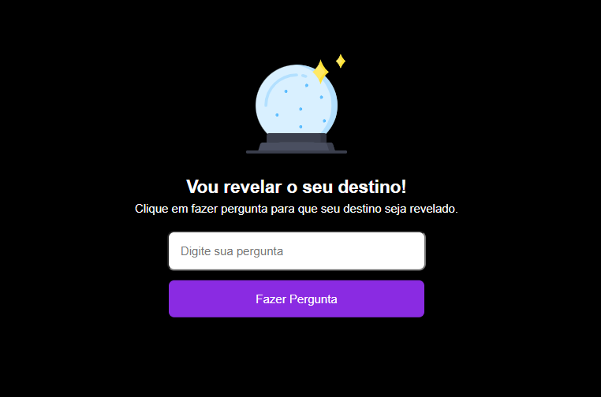

<h1 align="center">
  Destiny
</h1>

  

  <a href="#-tecnologias">Tecnologias</a>&nbsp;&nbsp;&nbsp;|&nbsp;&nbsp;&nbsp;
  <a href="#-projeto">Projeto</a>&nbsp;&nbsp;&nbsp;|&nbsp;&nbsp;&nbsp;
  <a href="#memo-licença">Licença</a>

## 🚀 Tecnologias

- HTML
- CSS
- JavaScript

## 🚧 Projeto

A ideia desse projeto é consolidar a ideia de HTML, CSS e JS, fazendo com que o programa advinhe seu futuro respondendo as suas perguntas

Live Preview: https://joaosam.github.io/Destiny/

## :memo: Licença

Esse projeto está sob a licença MIT. Veja o arquivo [LICENSE](LICENSE) para mais detalhes.
